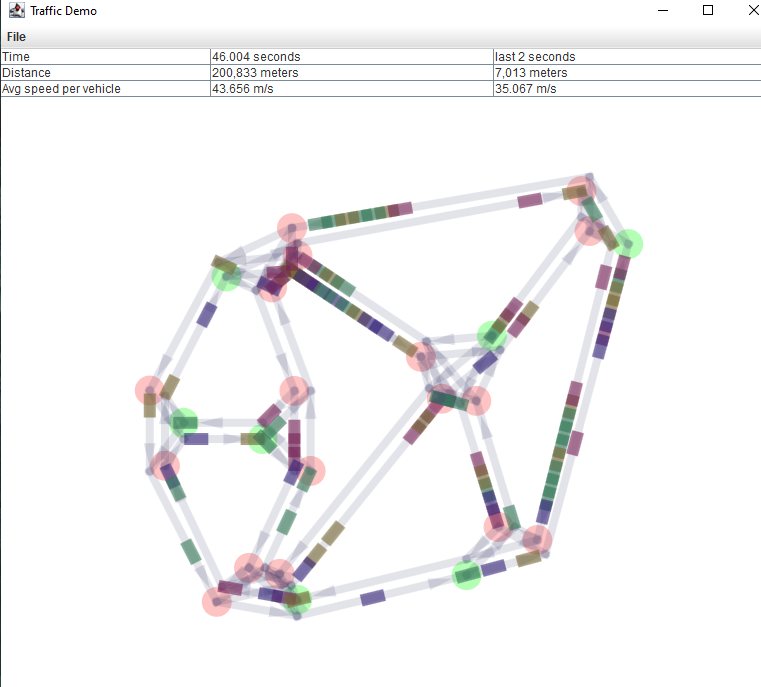

# bb4-traffic-simulation
Simulates traffic flow using graphs and sprites. 

## How to run it

Ensure that you are running Java 19 locally by running `java --version`. You can manage multiple versions with sdkman.

`./gradlew run`

or right click on `com/barrybecker4/simulations/traffic/TrafficApp`
within Intellij and select `run`.

     
 
